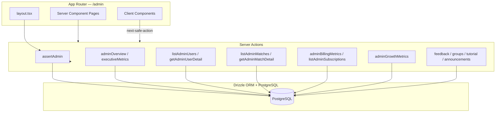

# Admin Dashboard — Design

**Spec**: `.specs/features/admin-dashboard/spec.md`
**Status**: Draft

---

## Architecture Overview

O admin segue o padrão existente do Arena Hub: **Next.js App Router** com Server Components para data fetching, Client Components apenas para interatividade (filtros, tabelas, dialogs), e **server actions** via `next-safe-action` sem API REST dedicada.

Toda action admin passa por `assertAdmin()` em `src/lib/admin/assert-admin.ts`. O layout em `src/app/admin/layout.tsx` delega a verificação para essa função.



---

## Code Reuse Analysis

### Componentes existentes a reutilizar

| Componente | Localização | Uso |
|------------|-------------|-----|
| `MetricCard` | `src/app/admin/_components/metric-card.tsx` | KPIs em dashboard, billing, growth |
| `AdminChart` | `src/app/admin/_components/admin-chart.tsx` | Gráficos genéricos |
| `OverviewActivityChart` | `src/app/admin/dashboard/_components/overview-activity-chart.tsx` | Série temporal (estender para período selecionável) |
| `AdminSidebar` / `AdminNavItems` | `src/app/admin/_components/` | Navegação (adicionar novos itens) |
| `GroupAdminDetailView` | `src/app/admin/_componentes/groups/detail/` | Detalhe de grupo (migrar + enriquecer) |
| `FeatureAnnouncementsAdmin` | `src/app/admin/announcements/` | CRUD novidades (sem alteração estrutural) |
| `FeedbackReviewTabs` | `src/app/admin/feedbacks/` | Moderação existente |

### Actions e libs existentes

| Recurso | Localização | Uso |
|---------|-------------|-----|
| `adminOverview` | `src/actions/admin/overview.ts` | Base para dashboard; otimizar queries |
| `listAdminGroups` / `getAdminGroupDetail` | `src/actions/admin/groups/` | Estender com métricas e tabs |
| `PLAN_TIER_PRICES` / `PLAN_LIMITS` | `src/lib/user-plan/plan-tiers.ts` | MRR e labels de tier |
| `getUserPlanContext` | `src/lib/user-plan/get-user-plan-context.ts` | Contexto de plano no detalhe de user |
| `sync-subscription` | `src/lib/stripe-billing/sync-subscription.ts` | Sync forçado (Epic 2/4 fase 2) |
| `subscription-status` | `src/lib/user-plan/subscription-status.ts` | Labels e agrupamento de status |
| Padrão auth inline | `src/actions/admin/overview.ts` | Substituir por `assertAdmin()` |

### Integrações

| Sistema | Método |
|---------|--------|
| PostgreSQL | Drizzle ORM — queries com `LIMIT`/`OFFSET`, agregações SQL |
| Stripe Dashboard | Links read-only (`https://dashboard.stripe.com/...`) — sem API admin adicional |
| Better Auth | Sessão via `auth.api.getSession` dentro de `assertAdmin()` |

---

## Estrutura de arquivos proposta

```
src/
├── lib/admin/
│   ├── assert-admin.ts
│   └── types.ts                    # tipos compartilhados admin
├── actions/admin/
│   ├── overview.ts                 # existente + adminExecutiveMetrics
│   ├── users/
│   │   ├── list.ts
│   │   ├── detail.ts
│   │   └── set-early-adopter.ts
│   ├── matches/
│   │   ├── list.ts
│   │   └── detail.ts
│   ├── billing/
│   │   ├── metrics.ts
│   │   └── subscriptions.ts
│   ├── growth/
│   │   └── metrics.ts
│   ├── moderation/
│   │   └── metrics.ts
│   └── search/
│       └── global-search.ts
└── app/admin/
    ├── _components/                # unificado (migrar _componentes)
    │   ├── admin-data-table.tsx
    │   ├── admin-date-range-filter.tsx
    │   ├── admin-empty-state.tsx
    │   ├── admin-search-command.tsx
    │   └── groups/                 # migrado de _componentes
    ├── dashboard/
    ├── users/
    │   ├── page.tsx
    │   └── [id]/page.tsx
    ├── matches/
    │   ├── page.tsx
    │   └── [id]/page.tsx
    ├── billing/
    │   └── page.tsx
    ├── growth/
    │   └── page.tsx
    ├── moderation/
    │   └── page.tsx
    └── tutorial/
        ├── page.tsx                # analytics existente
        └── content/page.tsx        # CRUD novo
```

---

## Components

### `assertAdmin()`

- **Purpose**: Verificação centralizada de acesso admin
- **Location**: `src/lib/admin/assert-admin.ts`
- **Interfaces**:
  - `assertAdmin(): Promise<AdminSession>` — lança erro ou retorna sessão validada
  - `isAdminEmail(email: string): boolean` — helper para sidebar do app principal
- **Dependencies**: `auth`, `process.env.ADMIN_EMAIL`
- **Reuses**: Lógica de `src/app/admin/layout.tsx` e `src/actions/admin/overview.ts`

```typescript
export interface AdminSession {
  userId: string;
  email: string;
  name: string;
}

export async function assertAdmin(): Promise<AdminSession>;
```

---

### `AdminDataTable`

- **Purpose**: Tabela paginada reutilizável com TanStack Table
- **Location**: `src/app/admin/_components/admin-data-table.tsx`
- **Interfaces**:
  - Props: `columns`, `data`, `pageCount`, `onPaginationChange`, `isLoading`
- **Dependencies**: `@tanstack/react-table`, shadcn `Table`
- **Reuses**: Padrões de tabela existentes no app (se houver); caso contrário, shadcn data-table pattern

---

### `AdminDateRangeFilter`

- **Purpose**: Seletor de período (7/30/90 dias ou range customizado)
- **Location**: `src/app/admin/_components/admin-date-range-filter.tsx`
- **Interfaces**:
  - `value: DateRange`, `onChange: (range: DateRange) => void`, `presets?: number[]`
- **Reuses**: shadcn `Calendar`, `Popover`

---

### `adminExecutiveMetrics`

- **Purpose**: KPIs de saúde da plataforma para dashboard v2
- **Location**: `src/actions/admin/overview.ts` (ou `executive-metrics.ts`)
- **Interfaces**:

```typescript
export interface AdminExecutiveMetricsData {
  period: { start: string; end: string };
  activeUsers: { d7: number; d30: number };
  activeGroups: { d7: number; d30: number };
  matchCompletionRate: number;
  subscribers: { active: number; pastDue: number; byTier: Record<PlanTier, number> };
  mrrEstimatedCents: number;
  earlyAdopters: number;
  pendingFeedbacks: number;
  pushSubscriptions: number;
  avgMembersPerGroup: number;
  alerts: Array<{ type: string; count: number; href: string }>;
}
```

- **Queries**: Subqueries/joins em `usersTable`, `organization`, `matchesTable`, `player`, `user_billing_subscription`, `feedback`, `push_subscriptions`
- **Reuses**: `adminOverview`, `PLAN_TIER_PRICES`

---

### `listAdminUsers`

- **Purpose**: Listagem paginada de usuários com filtros
- **Location**: `src/actions/admin/users/list.ts`
- **Interfaces**:

```typescript
export interface AdminUserListItem {
  id: string;
  name: string;
  email: string;
  image: string | null;
  emailVerified: boolean;
  isEarlyAdopter: boolean;
  planTier: PlanTier | null;
  subscriptionStatus: string | null;
  ownedGroupsCount: number;
  matchesPlayed: number;
  tutorialProgress: "not_started" | "in_progress" | "completed";
  lookingForGroup: boolean;
  createdAt: string;
}

export interface ListAdminUsersInput {
  page: number;
  pageSize: number;
  search?: string;
  planTier?: PlanTier;
  subscriptionStatus?: string;
  isEarlyAdopter?: boolean;
  emailVerified?: boolean;
  createdFrom?: string;
  createdTo?: string;
}
```

- **Queries**: `usersTable` LEFT JOIN `user_billing_subscription`, subqueries para counts de `member` (owner) e `player`, agregação tutorial

---

### `adminBillingMetrics` / `listAdminSubscriptions`

- **Purpose**: Métricas e listagem de assinaturas da plataforma
- **Location**: `src/actions/admin/billing/`
- **Interfaces**:

```typescript
export interface AdminBillingMetricsData {
  mrrEstimatedCents: number;
  subscribersByTier: Record<PlanTier, number>;
  newSubscriptions: number;
  cancellations: number;
  pastDue: number;
  cancelAtPeriodEnd: number;
  earlyAdoptersWithoutPlan: number;
  statusDistribution: Record<string, number>;
}

export interface AdminSubscriptionListItem {
  userId: string;
  userName: string;
  userEmail: string;
  planTier: PlanTier;
  status: string;
  currentPeriodStart: string;
  currentPeriodEnd: string;
  cancelAtPeriodEnd: boolean;
  gracePeriodEndsAt: string | null;
  stripeSubscriptionId: string;
}
```

- **Reuses**: `user_billing_subscription` schema, `PLAN_TIER_PRICES`, `subscription-status.ts`

---

### Navegação final (`adminNavItems`)

```
Dashboard          /admin/dashboard
Usuários           /admin/users
Grupos             /admin/groups
Partidas           /admin/matches
Billing            /admin/billing
Crescimento        /admin/growth        (fase 2 menu)
Feedbacks          /admin/feedbacks
Moderação          /admin/moderation    (fase 2 menu, ou seção)
Tutorial           /admin/tutorial
Novidades          /admin/announcements
```

---

## Data Models

### Entidades relevantes (existentes — sem migration)

| Tabela | Schema | Campos-chave admin |
|--------|--------|-------------------|
| `user` | `user.ts` | `emailVerified`, `isEarlyAdopter`, `lookingForGroup`, `createdAt` |
| `organization` | `auth.ts` | `private`, `lastActivityAt`, `maxPlayers` |
| `member` | `member.ts` | `role`, `suspendedUntilMatchCount` |
| `match` | `match.ts` | `status`, `sport`, `category`, `maxPlayers` |
| `player` | `player.ts` | confirmação, fila |
| `user_billing_subscription` | `user-billing.ts` | `planTier`, `status`, períodos, Stripe IDs |
| `feedback` | `feedback.ts` | `isApproved`, `rating` |
| `organization_invite_link` | `invite-link.ts` | crescimento |
| `requests` | `request.ts` | pedidos de entrada |
| `punishment` | `punishment.ts` | moderação |
| `push_subscriptions` | `subscription.ts` | alcance push (não billing) |

### Padrão de paginação (todas as listagens)

```typescript
interface PaginatedResponse<T> {
  items: T[];
  page: number;
  pageSize: number;
  totalCount: number;
  totalPages: number;
}
```

---

## Error Handling Strategy

| Cenário | Handling | Impacto UI |
|---------|----------|------------|
| Sessão ausente | `assertAdmin()` lança; action retorna erro | Redirect no layout; toast em client |
| E-mail não admin | `assertAdmin()` lança "Acesso negado" | Redirect `/` |
| ID não encontrado | Action retorna `null` ou 404 | `notFound()` na page |
| Query timeout / DB error | Log + erro genérico | Toast "Erro ao carregar dados" |
| Sync Stripe falha | Retornar mensagem do sync | Toast com detalhe |

---

## Tech Decisions

| Decisão | Escolha | Rationale |
|---------|---------|-----------|
| Auth admin | `assertAdmin()` centralizado, sem role DB | Mantém modelo atual; evita migration |
| Paginação | Server-side com TanStack Table | Performance com volume crescente |
| MRR | Preços fixos de `plan-tiers.ts` | Stripe prices podem diverger; estimativa explícita |
| Usuário ativo | Proxy via `player`/`match` recente | Sem tabela de analytics; suficiente para v1 |
| Dashboard metrics | Estender `overview.ts` vs arquivo novo | Cohesão; separar se arquivo > 300 linhas |
| Middleware `/admin` | Não implementar na v1 | Layout + assertAdmin cobrem; middleware é nice-to-have futuro |
| Partidas pagas UI | Remover/ocultar toggle existente | Escopo explícito excluído |
| Busca global | shadcn `Command` + Cmd+K | Padrão familiar; sem Elasticsearch |

---

## Performance Guidelines

1. Todas as listagens: `LIMIT`/`OFFSET` + `COUNT(*)` separado ou window function
2. Séries temporais: `DATE(created_at)` + `GROUP BY` no SQL
3. Evitar `findMany()` sem limite
4. Índices existentes em FKs (`userId`, `organizationId`, `matchId`) — verificar EXPLAIN em queries pesadas durante implementação
5. Feedbacks: substituir limite hardcoded 200 por paginação (backlog técnico, pode ser task separada)

---

## Menu e rotas — mapa de implementação

| Rota | Epic | Fase UI |
|------|------|---------|
| `/admin/dashboard` | 1 | Enriquecer page existente |
| `/admin/users` | 2 | Substituir mock |
| `/admin/users/[id]` | 2 | Nova |
| `/admin/matches` | 3 | Substituir mock |
| `/admin/matches/[id]` | 3 | Nova |
| `/admin/billing` | 4 | Nova |
| `/admin/growth` | 6 | Nova |
| `/admin/moderation` | 7 | Nova (ou tab no dashboard) |
| `/admin/tutorial/content` | 8 | Nova |
| `/admin/groups` | 5 | Enriquecer existente |
