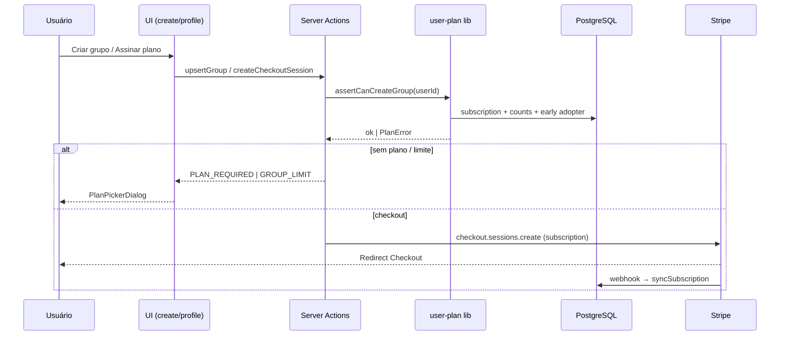
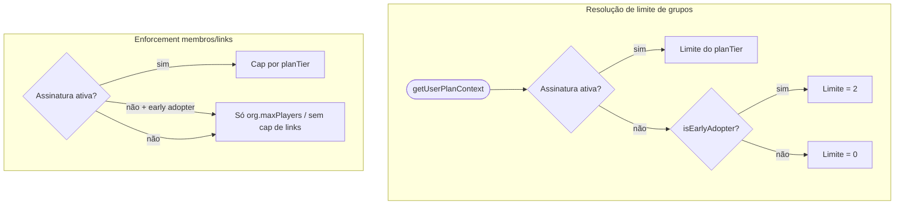

# Planos de Usuário — Design

**Spec**: `.specs/features/user-plans/spec.md`  
**Context**: `.specs/features/user-plans/context.md`  
**Status**: Draft

---

## Architecture Overview

A feature é implementada como uma **camada de domínio** (`user-plan`) que centraliza resolução de limites e gates, integrada ao **Stripe Billing** (Checkout + Customer Portal + webhooks) de forma **separada** do Stripe Connect já usado em partidas pagas.

Fluxo principal:

1. **Leitura**: `getUserPlanContext(userId)` consulta `user`, `user_billing_subscription` e contagens (grupos owner, links ativos).
2. **Escrita**: webhooks Stripe sincronizam assinatura; server actions criam Checkout/Portal sessions.
3. **Enforcement**: actions existentes (`upsertGroup`, `createInviteLink`, `previewInviteLink`, etc.) chamam assertions da camada `user-plan` antes de mutar estado.





---

## Code Reuse Analysis

### Existing Components to Leverage

| Component | Location | How to Use |
|-----------|----------|------------|
| `actionClient` | `src/lib/next-safe-action.ts` | Novas actions de checkout, portal e summary |
| `stripe` client | `src/lib/stripe.ts` | Reutilizar instância; billing na conta da plataforma (não Connect) |
| `requireAppUrl` | `src/lib/require-app-url.ts` | `success_url` / `cancel_url` / portal return |
| `applyPaidCheckoutSession` | `src/lib/apply-paid-checkout-session.ts` | Padrão de webhook handler com early return + idempotência |
| `ResponsiveDialog` | `src/components/responsive-dialog.tsx` | `PlanPickerDialog`, `EarlyAdopterLimitDialog` |
| `UpgradePlanDialog` | `src/app/(protected)/_components/upgrade-plan-dialog.tsx` | Substituir conteúdo; manter shell responsivo |
| `GroupLimitDialog` | `src/app/(protected)/group/create/_components/group-limit-dialog.tsx` | Trocar lógica beta por gate do `user-plan` |
| Webhook route | `src/app/api/stripe/webhooks/route.ts` | Estender com dispatch; handlers em módulo separado |
| `previewInviteLink` | `src/actions/invite-links/preview.ts` | Já verifica `group-full` via `maxPlayers` — estender com limite de plano |
| Profile tabs | `src/app/(protected)/profile/page.tsx` | Nova aba "Assinatura" no mesmo padrão |
| Drizzle schema | `src/db/schema/*.ts` | Novo schema; `drizzle-kit push` (projeto usa `out: ./drizzle`) |

### Integration Points

| System | Integration Method |
|--------|------------------|
| Better Auth `organization` | Criação continua via `auth.api.createOrganization`; gate **antes** da chamada |
| `member` table | Contagem `role = 'owner'` para limite de grupos; contagem por `organizationId` para membros |
| `organization_invite_link` | Links ativos = `revokedAt IS NULL`; soma nos grupos do owner |
| Stripe Connect (partidas) | **Sem alteração** — webhooks de subscription ignoram metadata de `matchId`/`playerRowId` |
| Stripe Billing | Products/Prices no Dashboard; Price IDs em env |

---

## Tech Decisions

| Decision | Choice | Rationale |
|----------|--------|-----------|
| Onde guardar early adopter | Coluna `is_early_adopter` em `user` | Flag permanente; não confundir com status de assinatura |
| Tabela de assinatura | `user_billing_subscription` (1:1 com user) | Evita colisão com `push_subscriptions` em `subscription.ts` |
| Checkout vs Payment Element | Stripe Checkout `mode: 'subscription'` | Alinhado a stripe-best-practices; menos UI custom |
| Gestão de assinatura | Customer Portal | Cancelamento, cartão e troca de plano sem UI própria |
| Idempotência webhook | Tabela `stripe_processed_event` | `event.id` único; requisito PLAN-17 |
| Resolução de limites | Lib pura `user-plan` | Um único lugar para early adopter + plano + uso |
| `past_due` | Grace period 3 dias (`PLAN_GRACE_PERIOD_DAYS`) | Mantém acesso durante dunning; depois trata como inativo |
| Downgrade (A2) | Stripe aplica no fim do ciclo via Portal | `currentPeriodEnd` + `planTier` sincronizados por webhook |
| Upgrade (A3) | Limites novos imediatos após `subscription.updated` | Webhook atualiza `planTier` assim que Stripe confirma |
| Contagem de membros no limite | `COUNT(member)` por grupo | Consistente com `previewInviteLink` existente |
| Cap de `maxPlayers` | `min(org.maxPlayers, planMaxMembers)` quando plano ativo | Owner não configura acima do plano |

---

## Data Models

### `user` (alteração)

```typescript
// src/db/schema/user.ts — campos adicionais
isEarlyAdopter: boolean("is_early_adopter").notNull().default(false),
earlyAdopterGrantedAt: timestamp("early_adopter_granted_at"),
stripeBillingCustomerId: text("stripe_billing_customer_id"), // cus_… plataforma
```

**Relationships**: 1:1 opcional com `user_billing_subscription`.

### `user_billing_subscription`

```typescript
// src/db/schema/user-billing.ts
export const planTierEnum = pgEnum("plan_tier", ["basic", "intermediate", "premium"]);

export const subscriptionStatusEnum = pgEnum("billing_subscription_status", [
  "active",
  "trialing",
  "past_due",
  "canceled",
  "incomplete",
  "incomplete_expired",
  "unpaid",
]);

export const userBillingSubscription = pgTable("user_billing_subscription", {
  userId: text("user_id")
    .primaryKey()
    .references(() => usersTable.id, { onDelete: "cascade" }),
  stripeSubscriptionId: text("stripe_subscription_id").notNull().unique(),
  planTier: planTierEnum("plan_tier").notNull(),
  status: subscriptionStatusEnum("status").notNull(),
  currentPeriodStart: timestamp("current_period_start").notNull(),
  currentPeriodEnd: timestamp("current_period_end").notNull(),
  cancelAtPeriodEnd: boolean("cancel_at_period_end").notNull().default(false),
  gracePeriodEndsAt: timestamp("grace_period_ends_at"), // past_due + N dias
  createdAt: timestamp("created_at").notNull().defaultNow(),
  updatedAt: timestamp("updated_at").notNull().defaultNow(),
});
```

### `stripe_processed_event` (idempotência)

```typescript
export const stripeProcessedEvent = pgTable("stripe_processed_event", {
  eventId: text("event_id").primaryKey(), // evt_…
  type: text("type").notNull(),
  processedAt: timestamp("processed_at").notNull().defaultNow(),
});
```

### Tipos de domínio (`src/lib/user-plan/types.ts`)

```typescript
export type PlanTier = "basic" | "intermediate" | "premium";

export type PlanLimits = {
  maxGroups: number;
  maxMembersPerGroup: number | null; // null = ilimitado
  maxInviteLinksTotal: number | null;
};

export type UserPlanContext = {
  userId: string;
  isEarlyAdopter: boolean;
  subscription: {
    planTier: PlanTier;
    status: string;
    currentPeriodEnd: Date;
    cancelAtPeriodEnd: boolean;
    isEffectivelyActive: boolean; // active | trialing | past_due in grace
  } | null;
  limits: PlanLimits;
  usage: {
    ownedGroups: number;
    activeInviteLinks: number;
  };
};

export type PlanErrorCode =
  | "PLAN_REQUIRED"
  | "GROUP_LIMIT"
  | "EARLY_ADOPTER_GROUP_LIMIT"
  | "MEMBER_LIMIT"
  | "INVITE_LINK_LIMIT"
  | "MAX_PLAYERS_EXCEEDS_PLAN";
```

### Constantes de tier (`src/lib/user-plan/plan-tiers.ts`)

```typescript
export const PLAN_LIMITS: Record<PlanTier, PlanLimits> = {
  basic: { maxGroups: 1, maxMembersPerGroup: 30, maxInviteLinksTotal: 3 },
  intermediate: { maxGroups: 3, maxMembersPerGroup: 60, maxInviteLinksTotal: 6 },
  premium: { maxGroups: 10, maxMembersPerGroup: null, maxInviteLinksTotal: null },
};

export const EARLY_ADOPTER_FREE_GROUPS = 2;
```

### Mapeamento Price ID → tier

```typescript
// src/lib/stripe-billing/map-price-to-tier.ts
export function priceIdToPlanTier(priceId: string): PlanTier | null {
  const map: Record<string, PlanTier> = {
    [process.env.STRIPE_PRICE_BASIC!]: "basic",
    [process.env.STRIPE_PRICE_INTERMEDIATE!]: "intermediate",
    [process.env.STRIPE_PRICE_PREMIUM!]: "premium",
  };
  return map[priceId] ?? null;
}
```

### Migration early adopters (one-shot)

Script `src/db/scripts/grant-early-adopters.ts` executado no deploy de lançamento:

```sql
-- Pseudológica
UPDATE "user" u
SET is_early_adopter = true,
    early_adopter_granted_at = NOW()
WHERE EXISTS (
  SELECT 1 FROM member m
  WHERE m.user_id = u.id AND m.role = 'owner'
);
```

`PLAN_LAUNCH_DATE` usada como cutoff se o script rodar após a data (filtrar `organization.created_at < launch` ou `member.created_at`).

---

## Components

### `getUserPlanContext`

- **Purpose**: Ponto único de leitura — assinatura, early adopter, limites efetivos e uso atual.
- **Location**: `src/lib/user-plan/get-user-plan-context.ts`
- **Interfaces**:
  - `getUserPlanContext(userId: string): Promise<UserPlanContext>`
  - `resolveGroupLimit(ctx: UserPlanContext): number`
  - `shouldEnforcePlanMemberAndLinkLimits(ctx: UserPlanContext): boolean`
- **Dependencies**: Drizzle (`user`, `user_billing_subscription`, `member`, `organization_invite_link`)
- **Reuses**: Padrão de queries em `src/actions/invite-links/list.ts`

**Lógica `resolveGroupLimit`:**

```typescript
function resolveGroupLimit(ctx: UserPlanContext): number {
  if (ctx.subscription?.isEffectivelyActive) {
    return PLAN_LIMITS[ctx.subscription.planTier].maxGroups;
  }
  if (ctx.isEarlyAdopter) return EARLY_ADOPTER_FREE_GROUPS;
  return 0;
}
```

**Lógica `shouldEnforcePlanMemberAndLinkLimits`:**

```typescript
// true apenas com assinatura efetivamente ativa
return ctx.subscription?.isEffectivelyActive === true;
```

---

### `user-plan/assertions`

- **Purpose**: Validações reutilizáveis com códigos de erro tipados.
- **Location**: `src/lib/user-plan/assertions.ts`
- **Interfaces**:
  - `assertCanCreateGroup(ctx: UserPlanContext): void` → `PLAN_REQUIRED` | `GROUP_LIMIT` | `EARLY_ADOPTER_GROUP_LIMIT`
  - `assertCanSetMaxPlayers(ctx, maxPlayers): void`
  - `assertCanAddMemberToGroup(ctx, organizationId, currentMemberCount): void`
  - `assertCanCreateInviteLink(ctx): void`
- **Dependencies**: `getUserPlanContext`, constantes de tier
- **Reuses**: Lançar `Error` com `code` em metadata ou classe `PlanLimitError extends Error`

---

### `user-plan/queries`

- **Purpose**: Contagens usadas pelo context e assertions.
- **Location**: `src/lib/user-plan/queries.ts`
- **Interfaces**:
  - `countOwnedGroups(userId: string): Promise<number>`
  - `countActiveInviteLinksForOwner(userId: string): Promise<number>`
  - `getOrganizationOwnerUserId(organizationId: string): Promise<string | null>`
  - `getEffectiveMemberCapForOrganization(organizationId: string): Promise<number | null>`
- **Dependencies**: `member`, `organization_invite_link`, `organization`
- **Reuses**: `sql\`count(*)\`` como em `preview.ts`

`getEffectiveMemberCapForOrganization`: busca owner → `getUserPlanContext` → se enforcement ativo, retorna `min(org.maxPlayers, plan.maxMembersPerGroup ?? ∞)`; senão `org.maxPlayers`.

---

### `stripe-billing/checkout`

- **Purpose**: Criar Checkout Session para assinatura mensal.
- **Location**: `src/lib/stripe-billing/create-subscription-checkout.ts`
- **Interfaces**:
  - `createSubscriptionCheckout({ userId, email, planTier }): Promise<{ url: string }>`
- **Dependencies**: `stripe`, env price IDs, `stripeBillingCustomerId` no user
- **Reuses**: Padrão de `createMatchCheckoutSession` (session, `requireAppUrl`, metadata)

```typescript
await stripe.checkout.sessions.create({
  mode: "subscription",
  customer: customerId, // criar ou reutilizar
  client_reference_id: userId,
  line_items: [{ price: priceId, quantity: 1 }],
  subscription_data: {
    metadata: { userId, planTier },
  },
  metadata: { userId, planTier, type: "platform_subscription" },
  success_url: `${baseUrl}/profile?tab=subscription&checkout=success`,
  cancel_url: `${baseUrl}/group/create?checkout=canceled`,
});
```

> **Não** incluir `payment_method_types` (dynamic payment methods).

---

### `stripe-billing/portal`

- **Purpose**: Sessão do Customer Portal para gerenciar assinatura.
- **Location**: `src/lib/stripe-billing/create-billing-portal-session.ts`
- **Interfaces**:
  - `createBillingPortalSession(userId: string): Promise<{ url: string }>`
- **Dependencies**: `stripeBillingCustomerId` existente
- **Reuses**: `requireAppUrl` para `return_url`

---

### `stripe-billing/sync-subscription`

- **Purpose**: Upsert de `user_billing_subscription` a partir de objeto Stripe `Subscription`.
- **Location**: `src/lib/stripe-billing/sync-subscription.ts`
- **Interfaces**:
  - `syncSubscriptionFromStripe(sub: Stripe.Subscription, userId: string): Promise<void>`
  - `isSubscriptionEffectivelyActive(record): boolean`
- **Dependencies**: `priceIdToPlanTier`, grace period env
- **Reuses**: Padrão de `applyPaidCheckoutSession`

**`isSubscriptionEffectivelyActive`:**

| status | Ativo? |
|--------|--------|
| `active`, `trialing` | Sim |
| `past_due` | Sim se `now < gracePeriodEndsAt` |
| `canceled`, `unpaid`, etc. | Não |

---

### `stripe-billing/webhooks`

- **Purpose**: Handlers idempotentes para eventos de billing.
- **Location**: `src/lib/stripe-billing/webhooks.ts`
- **Interfaces**:
  - `handleStripeBillingWebhook(event: Stripe.Event): Promise<"handled" | "ignored">`
- **Eventos**:

| Evento | Ação |
|--------|------|
| `checkout.session.completed` | Se `metadata.type === 'platform_subscription'`, buscar subscription e `sync` |
| `customer.subscription.created` | `sync` |
| `customer.subscription.updated` | `sync` (upgrade imediato / downgrade refletido pelo Stripe) |
| `customer.subscription.deleted` | status `canceled`, `isEffectivelyActive = false` |
| `invoice.payment_failed` | status `past_due`, set `gracePeriodEndsAt` |

- **Dependencies**: `stripe_processed_event`, `sync-subscription`
- **Reuses**: Estender `src/app/api/stripe/webhooks/route.ts`:

```typescript
// route.ts — ordem sugerida
if (await handleStripeBillingWebhook(event)) {
  return NextResponse.json({ received: true });
}
// handlers existentes de partidas pagas…
```

Filtro: eventos de match checkout têm `metadata.matchId`; subscription tem `metadata.type = platform_subscription`.

---

### Server Actions (`src/actions/user-plan/`)

| Action | Purpose | Req IDs |
|--------|---------|---------|
| `createPlanCheckoutSession` | Inicia checkout para `planTier` | PLAN-03 |
| `createBillingPortalSession` | URL do portal | PLAN-13 |
| `getSubscriptionSummary` | Dados para UI do perfil | PLAN-12 |

Todas usam `actionClient` + `auth.api.getSession`.

---

### UI: `PlanPickerDialog`

- **Purpose**: Comparativo dos 3 planos + CTA assinar; substitui placeholder beta.
- **Location**: `src/app/(protected)/_components/plan-picker-dialog.tsx`
- **Props**:
  - `open`, `onOpenChange`
  - `reason: 'plan_required' | 'group_limit' | 'early_adopter_limit' | 'upgrade'`
  - `currentTier?: PlanTier`
  - `ownedGroups?: number`
- **Dependencies**: `PlanTierCard`, `createPlanCheckoutSession`
- **Reuses**: `ResponsiveDialog`, estilos de cards existentes

**Variante `early_adopter_limit`:** título e texto de `context.md` antes do grid de planos.

---

### UI: `PlanTierCard`

- **Purpose**: Card individual com preço, limites e botão "Assinar".
- **Location**: `src/app/(protected)/_components/plan-tier-card.tsx`
- **Props**: `tier`, `priceLabel`, `limits`, `highlighted?`, `onSelect`, `loading?`

---

### UI: `CreateGroupGate` (substitui `GroupLimitDialog`)

- **Purpose**: Server wrapper em `create/layout.tsx` que carrega `getUserPlanContext` e renderiza gate ou `children`.
- **Location**: `src/app/(protected)/group/create/_components/create-group-gate.tsx`
- **Behavior**:

| Condição | UI |
|----------|-----|
| `ownedGroups < limit` | Renderiza formulário |
| `PLAN_REQUIRED` | `PlanPickerDialog` aberto |
| `EARLY_ADOPTER_GROUP_LIMIT` | `PlanPickerDialog` com `reason=early_adopter_limit` |
| `GROUP_LIMIT` com plano | `PlanPickerDialog` com `reason=upgrade` |

- **Reuses**: Remove dependência de `listOrganizations().length`.

---

### UI: `SubscriptionSection`

- **Purpose**: Aba "Assinatura" no perfil.
- **Location**: `src/app/(protected)/profile/_components/subscription-section.tsx`
- **Exibe**:
  - Early adopter: badge + "2 grupos sem assinatura" + uso `ownedGroups/2`
  - Assinante: plano, status, renovação, uso grupos/links, botão Portal
  - Sem plano: CTA para planos
- **Dependencies**: `getSubscriptionSummary`, `createBillingPortalSession`
- **Reuses**: Padrão de tabs em `profile/page.tsx`, `Badge`, `Progress`

---

## Enforcement Map (onde aplicar gates)

| Arquivo | Mudança | Req IDs |
|---------|---------|---------|
| `src/actions/group/create.ts` | `assertCanCreateGroup` + `assertCanSetMaxPlayers` na criação | PLAN-01, 06, 07 |
| `src/app/(protected)/group/create/layout.tsx` | `CreateGroupGate` | PLAN-01, 09, 21 |
| `src/actions/invite-links/create.ts` | `assertCanCreateInviteLink` | PLAN-08 |
| `src/actions/invite-links/preview.ts` | Checar cap efetivo de membros do owner | PLAN-07, 11 |
| `src/actions/group/review-join-request.ts` | Mesmo cap ao aprovar | PLAN-07 |
| `src/app/(protected)/group/.../config-access-form.tsx` | Validar `maxPlayers` no client + server | PLAN-07 |
| `src/app/(protected)/_components/upgrade-plan-dialog.tsx` | Deprecar ou redirecionar para `PlanPickerDialog` | PLAN-14 |

**Participação gratuita (PLAN-11):** nenhum gate em `join.ts`, aceitar convite, ou entrar em fila — apenas ações onde o **visitante** não é owner.

---

## Error Handling Strategy

| Cenário | Handling | User Impact |
|---------|----------|-------------|
| `PLAN_REQUIRED` | Action retorna erro tipado; layout abre `PlanPickerDialog` | "Assine um plano para criar seu grupo" |
| `EARLY_ADOPTER_GROUP_LIMIT` | Dialog com mensagem Early Adopter + planos | Texto de `context.md` |
| `GROUP_LIMIT` | Dialog sugere upgrade | "Seu plano permite X grupos" |
| `INVITE_LINK_LIMIT` | Toast/erro na action | "Limite de links — revogue ou faça upgrade" |
| `MEMBER_LIMIT` / grupo cheio | Status `group-full` existente | Mesma UX de `status-group-full.tsx` |
| Checkout Stripe falha | Toast + retry | "Não foi possível iniciar pagamento" |
| Webhook duplicado | Insert `stripe_processed_event` ignora | Nenhum |
| Price ID desconhecido no webhook | Log + alerta; não atualizar tier | Investigar config Stripe |
| `past_due` fora do grace | `isEffectivelyActive = false` | Tratado como sem plano para **novas** criações |

Classe sugerida:

```typescript
export class PlanLimitError extends Error {
  constructor(
    public readonly code: PlanErrorCode,
    message: string,
    public readonly meta?: Record<string, unknown>,
  ) {
    super(message);
    this.name = "PlanLimitError";
  }
}
```

---

## Environment Variables

```bash
# Novos — adicionar a .env.example
STRIPE_PRICE_BASIC=price_…
STRIPE_PRICE_INTERMEDIATE=price_…
STRIPE_PRICE_PREMIUM=price_…
PLAN_LAUNCH_DATE=2026-07-01T00:00:00.000Z
PLAN_GRACE_PERIOD_DAYS=3
```

`STRIPE_BILLING_PORTAL_RETURN_URL` opcional — default `${NEXT_PUBLIC_APP_URL}/profile?tab=subscription`.

---

## Stripe Dashboard Setup (pré-implementação)

1. Criar 3 Products com Prices recorrentes mensais em **BRL**.
2. Configurar **Customer Portal**: permitir cancelamento, troca de plano, atualização de cartão.
3. Portal: downgrade no **fim do período**; upgrade com **proration** (A2/A3).
4. Webhook endpoint: adicionar eventos `customer.subscription.*`, `checkout.session.completed`, `invoice.payment_failed`.
5. Metadata nos Prices (opcional): `planTier` para debug.

---

## Requirement Traceability → Design

| Req ID | Componente(s) |
|--------|---------------|
| PLAN-01, 02 | `CreateGroupGate`, `assertCanCreateGroup`, `upsertGroup` |
| PLAN-03–05 | `create-subscription-checkout`, webhooks, env prices |
| PLAN-06 | `resolveGroupLimit`, `assertCanCreateGroup` |
| PLAN-07 | `getEffectiveMemberCapForOrganization`, `preview`, `review-join-request` |
| PLAN-08 | `assertCanCreateInviteLink`, `countActiveInviteLinksForOwner` |
| PLAN-09, 10, 21 | `isEarlyAdopter`, `EARLY_ADOPTER_FREE_GROUPS`, `PlanPickerDialog` |
| PLAN-11 | Ausência de gates em fluxos de join |
| PLAN-12, 13 | `SubscriptionSection`, `create-billing-portal-session` |
| PLAN-14, 15 | `PlanPickerDialog`, `PlanTierCard` |
| PLAN-16, 17 | `webhooks.ts`, `stripe_processed_event` |
| PLAN-18 | `countOwnedGroups` (não `listOrganizations`) |
| PLAN-19 | `isSubscriptionEffectivelyActive`, A1 em assertions |
| PLAN-20 | `user-billing.ts`, migration early adopters |

---

## Fora do design (Tasks / Execute)

- Testes E2E com Stripe CLI (`stripe trigger`)
- Seeds de sandbox
- Configuração manual do Dashboard Stripe
- Textos finais de marketing nos cards de plano

---

## Próximo passo

Gerar `tasks.md` com ordem de implementação:

1. Schema + env + script early adopters  
2. `user-plan` lib (context, queries, assertions)  
3. Stripe billing (checkout, sync, webhooks)  
4. Gates nas actions  
5. UI (PlanPicker, SubscriptionSection, CreateGroupGate)  
6. Validação sandbox
