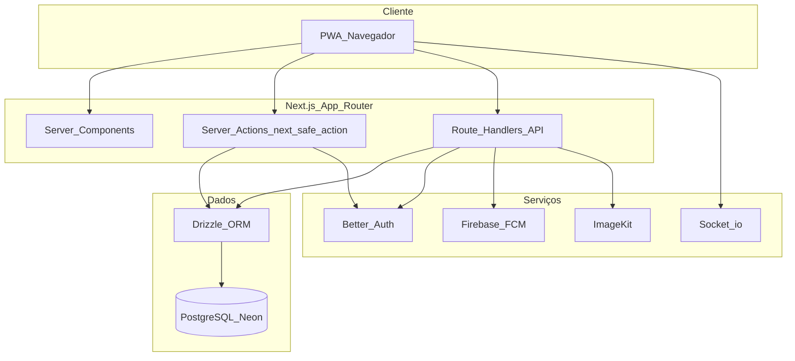

# Arena Hub

**Chega de WhatsApp para organizar suas peladas.**

[](https://nextjs.org/)
[](https://react.dev/)
[](https://www.typescriptlang.org/)
[](https://tailwindcss.com/)
[](https://orm.drizzle.team/)
[](https://neon.tech/)
[](https://www.better-auth.com/)
[](https://serwist.pages.dev/)

Plataforma web (PWA) para **organizar grupos esportivos**, **partidas**, **confirmações de presença**, **sorteio de times** e **notificações** — tudo em um só lugar, pensada para quem coordena peladas e times recorrentes.

> **Status:** fase beta — acesso gratuito completo para testes.

---

## Sobre o projeto

O **Arena Hub** centraliza o que normalmente fica espalhado em grupos de mensagens: quem vai jogar, onde e quando é a partida, limite de vagas e divisão dos times. Organizadores criam **grupos** com código único, aprovam **membros**, abrem **inscrições** para partidas e usam o **sorteio de times** com balanceamento por **score** dos jogadores. A experiência é **instalável no celular** (PWA) e pode enviar **notificações push** para avisar o grupo.

Há também **tutorial guiado**, **feedbacks** enviados pelos usuários (com curadoria no painel admin) e um **painel administrativo** com visão geral da plataforma.

---

## Principais funcionalidades

### Grupos

- Criação de grupo com **código único** para convite.
- Configurações como **público/privado**, **regras** e **limite máximo de jogadores**.

### Membros

- **Solicitações de entrada** e fluxo de aprovação.
- Papéis de organização: **`admin`**, **`member`**, **`guest`** (Better Auth + plugin `organization`).
- **Score** por membro, usado no balanceamento na hora de montar os times.

### Partidas

- Agendamento com data, horário, local, esporte e categoria.
- **Mínimo e máximo** de jogadores.
- Ciclo de status: `scheduled` → `open_registration` → `closed_registration` → `team_sorted` → `completed` (ou `cancelled`).

### Sorteio de times

- Interface com **drag-and-drop** (`@dnd-kit`, `@hello-pangea/dnd`) para montar e ajustar times de forma visual.

### Tempo real

- Atualizações em tempo real na partida via **`socket.io-client`** (URL configurável).

### Notificações e PWA

- **Firebase Cloud Messaging (FCM)** + **web-push** e **Service Worker** (Serwist).
- **PWA instalável** (`manifest.webmanifest`, ícones em `public/icons/`).

### Feedback e onboarding

- **Feedback in-app** armazenado no banco; aprovação no admin (`is_approved`).
- **Tutorial** com métricas de progresso para a equipe de produto.

### Administração

- Área **`/admin`** restrita ao e-mail definido em `ADMIN_EMAIL`.
- Dashboards com **Recharts**, tabelas com **TanStack Table**, gestão de grupos, usuários, partidas, tutorial e feedbacks.

### Mídia

- Upload de imagens com autenticação via **ImageKit** (`@imagekit/next` + rota de assinatura).

---

## Stack tecnológica

### Core

- [Next.js](https://nextjs.org/) 15 (App Router, Server Actions)
- [React](https://react.dev/) 19
- [TypeScript](https://www.typescriptlang.org/) 5

### UI e estilo

- [Tailwind CSS](https://tailwindcss.com/) v4 (`@tailwindcss/postcss`)
- [Radix UI](https://www.radix-ui.com/) (componentes acessíveis)
- [class-variance-authority](https://cva.style/docs), [clsx](https://github.com/lukeed/clsx), [tailwind-merge](https://github.com/dcastil/tailwind-merge)
- [Lucide React](https://lucide.dev/) e [@tabler/icons-react](https://tabler.io/icons)
- [next-themes](https://github.com/pacocoursey/next-themes) (claro/escuro)
- [vaul](https://github.com/emilkowalski/vaul) (drawer), [sonner](https://sonner.emilkowal.ski/) (toasts)
- [tw-animate-css](https://github.com/Wombosvideo/tw-animate-css), [tailwind-scrollbar](https://github.com/adoxography/tailwind-scrollbar)

### Formulários e validação

- [React Hook Form](https://react-hook-form.com/)
- [Zod](https://zod.dev/)
- [@hookform/resolvers](https://github.com/react-hook-form/resolvers)
- [react-day-picker](https://react-day-picker.js.org/), [input-otp](https://input-otp.rodz.dev/), [react-number-format](https://s-yadav.github.io/react-number-format/)

### Estado e server actions

- [@tanstack/react-query](https://tanstack.com/query) (+ DevTools)
- [Zustand](https://zustand-demo.pmnd.rs/)
- [next-safe-action](https://next-safe-action.dev/)

### Banco de dados

- [PostgreSQL](https://www.postgresql.org/) (recomendado: [Neon](https://neon.tech/) com [`@neondatabase/serverless`](https://github.com/neondatabase/serverless))
- [Drizzle ORM](https://orm.drizzle.team/) + [Drizzle Kit](https://orm.drizzle.team/kit-docs/overview)
- [drizzle-seed](https://orm.drizzle.team/docs/seed-overview) para seeds

### Autenticação

- [Better Auth](https://www.better-auth.com/) com adapter Drizzle
- E-mail e senha + **Google OAuth**
- Plugin **organization** (grupos como “organizações”) com controle de acesso (`src/lib/permissions.ts`)

### Tabelas e gráficos

- [@tanstack/react-table](https://tanstack.com/table)
- [Recharts](https://recharts.org/)

### Drag-and-drop

- [@dnd-kit](https://dndkit.com/) (core, sortable, modifiers)
- [@hello-pangea/dnd](https://github.com/hello-pangea/dnd)

### PWA, push e tempo real

- [@serwist/next](https://serwist.pages.dev/) + [serwist](https://github.com/serwist/serwist)
- [Firebase](https://firebase.google.com/) (client) e [firebase-admin](https://firebase.google.com/docs/admin/setup) (servidor)
- [web-push](https://github.com/web-push-libs/web-push)
- [socket.io-client](https://socket.io/docs/v4/client-api/)

### Outros

- [@imagekit/next](https://imagekit.io/) — uploads
- [date-fns](https://date-fns.org/) e [dayjs](https://day.js.org/) — datas
- [@vercel/analytics](https://vercel.com/docs/analytics) — analytics
- [nookies](https://github.com/maticzav/nookies) — cookies (SSR/CSR)
- [dotenv](https://github.com/motdotla/dotenv) — ambiente local

### Qualidade e tooling

- [ESLint](https://eslint.org/) 9 + `eslint-config-next`
- [Prettier](https://prettier.io/) + `prettier-plugin-tailwindcss`
- [@faker-js/faker](https://fakerjs.dev/) e [tsx](https://github.com/privatenumber/tsx) — dados de exemplo / scripts

---

## Arquitetura (visão geral)



---

## Estrutura de pastas (resumida)

```
src/
  app/
    (landing)/          # Site público (marketing)
    (protected)/        # Área logada: home, grupos, perfil, feed, etc.
    admin/              # Painel administrativo
    auth/               # Entrada e cadastro
    api/                # Rotas API (auth, upload, etc.)
    sw.ts               # Service Worker (Serwist)
  actions/              # Server actions (next-safe-action)
  components/           # UI compartilhada (shadcn + componentes próprios)
  db/
    schema/             # Esquema Drizzle (user, auth, member, match, player, feedback, …)
    seed/               # Scripts de população
  lib/                  # auth, firebase, websocket, react-query, permissions
  hooks/                # Hooks (push, etc.)
public/
  icons/                # Ícones PWA
  sw.js                 # SW gerado (build)
drizzle/                # Artefatos do Drizzle Kit (migrations, etc.)
```

---

## Pré-requisitos

- **Node.js** 20 ou superior
- **npm**, pnpm, yarn ou bun
- Conta **PostgreSQL** (ex.: Neon) e URL de conexão
- Projeto **Firebase** (FCM para web + credenciais Admin para envio no servidor)
- **Google Cloud Console** — OAuth (Client ID / Secret) para login com Google
- Conta **ImageKit** (chaves pública e privada)
- Opcional: servidor **Socket.io** para tempo real (URL em `NEXT_PUBLIC_WEBSOCKET_URL`)

---

## Instalação e execução

```bash
git clone https://github.com/SEU_USUARIO/arena-hub.git
cd arena-hub
npm install
```

1. Copie as variáveis de ambiente (veja a tabela abaixo) para um arquivo **`.env.local`** na raiz do projeto.
2. Aplique o schema ao banco:

   ```bash
   npx drizzle-kit push
   ```

3. Inicie o servidor de desenvolvimento:

   ```bash
   npm run dev
   ```

4. Abra [http://localhost:3000](http://localhost:3000).

Opcional — popular dados de exemplo:

```bash
npm run populate
```

---

## Variáveis de ambiente

Valores usados no código da aplicação (configure no `.env.local` ou no painel do seu host):

| Variável                                   | Obrigatória       | Descrição                                                             |
| ------------------------------------------ | ----------------- | --------------------------------------------------------------------- |
| `DATABASE_URL`                             | Sim               | URL do PostgreSQL (ex.: Neon).                                        |
| `BETTER_AUTH_SECRET`                       | Sim               | Segredo do Better Auth.                                               |
| `GOOGLE_CLIENT_ID`                         | Sim\*             | Client ID OAuth Google.                                               |
| `GOOGLE_CLIENT_SECRET`                     | Sim\*             | Client Secret OAuth Google.                                           |
| `ADMIN_EMAIL`                              | Sim para `/admin` | E-mail do administrador da plataforma.                                |
| `NEXT_PUBLIC_WEBSOCKET_URL`                | Não               | URL do servidor Socket.io. Padrão no código: `http://localhost:3001`. |
| `NEXT_PUBLIC_FIREBASE_API_KEY`             | Sim para push     | Firebase Web SDK.                                                     |
| `NEXT_PUBLIC_FIREBASE_AUTH_DOMAIN`         | Sim para push     | Firebase Web SDK.                                                     |
| `NEXT_PUBLIC_FIREBASE_PROJECT_ID`          | Sim para push     | Firebase Web SDK.                                                     |
| `NEXT_PUBLIC_FIREBASE_STORAGE_BUCKET`      | Sim para push     | Firebase Web SDK.                                                     |
| `NEXT_PUBLIC_FIREBASE_MESSAGING_SENDER_ID` | Sim para push     | Firebase Web SDK.                                                     |
| `NEXT_PUBLIC_FIREBASE_APP_ID`              | Sim para push     | Firebase Web SDK.                                                     |
| `NEXT_PUBLIC_FIREBASE_VAPID_KEY`           | Sim para push     | Chave pública VAPID (FCM web).                                        |
| `FIREBASE_PROJECT_ID`                      | Servidor          | Admin SDK — projeto.                                                  |
| `FIREBASE_CLIENT_EMAIL`                    | Servidor          | Admin SDK — e-mail da service account.                                |
| `FIREBASE_PRIVATE_KEY`                     | Servidor          | Admin SDK — chave privada (use `\n` para quebras de linha no `.env`). |
| `IMAGEKIT_PUBLIC_KEY`                      | Upload            | ImageKit — chave pública.                                             |
| `IMAGEKIT_PRIVATE_KEY`                     | Upload            | ImageKit — chave privada (nunca exponha no cliente).                  |

\*Obrigatórias se você habilitar login com Google; o e-mail/senha pode funcionar sem elas conforme sua configuração do Better Auth.

> O Better Auth também usa **`trustedOrigins`** em [`src/lib/auth.ts`](src/lib/auth.ts) (localhost e IPs de rede local). Em produção, ajuste para o domínio real da aplicação.

---

## Scripts disponíveis

| Comando            | Descrição                                       |
| ------------------ | ----------------------------------------------- |
| `npm run dev`      | Servidor de desenvolvimento Next.js.            |
| `npm run build`    | Build de produção.                              |
| `npm run start`    | Sobe o servidor após `build`.                   |
| `npm run lint`     | ESLint.                                         |
| `npm run populate` | Executa o seed (`tsx src/db/seed/populate.ts`). |

**Drizzle Kit** (via `npx`):

- `npx drizzle-kit push` — sincroniza schema com o banco.
- `npx drizzle-kit generate` — gera migrations a partir do schema.
- `npx drizzle-kit studio` — UI para inspecionar dados.

---

## PWA e notificações push

1. **Instalar o app:** no Chrome/Edge (Android) ou Safari (iOS), use “Adicionar à tela inicial” / “Instalar app” quando o navegador oferecer — o `manifest.webmanifest` e os ícones em `public/icons/` habilitam a experiência PWA.
2. **Push:** o app solicita permissão de notificação; o token FCM é associado ao usuário e persistido (ex.: tabela `push_subscriptions` no schema Drizzle). O envio em massa usa **Firebase Admin** + **web-push** no backend.

Em desenvolvimento, o Serwist desabilita o SW (`next.config.ts`) para evitar conflitos com o hot reload.

---

## Contribuindo

1. Faça um **fork** do repositório.
2. Crie uma branch: `git checkout -b feat/minha-feature`.
3. Commit com mensagens claras (recomendado: [Conventional Commits](https://www.conventionalcommits.org/)).
4. Rode `npm run lint` antes do PR.
5. Abra um **Pull Request** descrevendo mudanças e como testar.

---

## Licença

Este repositório está sob a licença **MIT**.

---

## Autor

**Vinícius Santos**

- GitHub: [@ViniciusSantos31](https://github.com/viniciussantos31).
- LinkedIn: [Vinicius dos Santos](https://www.linkedin.com/in/viniciussantos31).

---

Feito com foco em quem organiza peladas sem perder tempo em grupos de mensagem.
